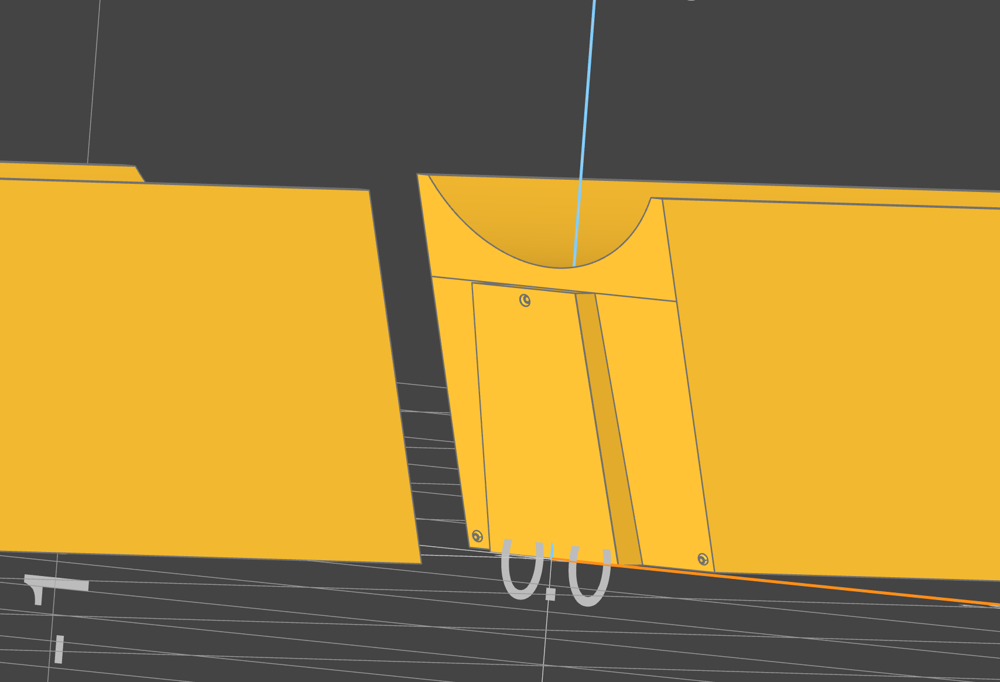

# Dovetail

# dovetail_subpart Function Documentation

## Overview

Dovetail is intended for breaking large parts into a dovetail and socketed part that can be easily fitted together with very tight and precice tolerances. This might be useful, for example, when designed parts that cannot fit onto common 3d-printer beds, and must be broken into multiple parts.



The `dovetail_subpart` function takes a build123d part and necesarry parameters to break it into either the dovetail or the socket component of the split.

## Arguments

- `subpart` (Part): The part to split into a dovetail or socket part. The part should be oriented along the XY plane.
- `start` (Point): The start point along the XY Plane for the dovetail line.
- `end` (Point): The end point along the XY Plane for the dovetail line.
- `section` (DovetailPart, default=DovetailPart.TAIL): The section of the dovetail to create (DovetailPart.TAIL or DovetailPart.SOCKET).
- `linear_offset` (float, default=0): Offsets the center of the tail or socket along the line by the amount specified.
- `tolerance` (float, default=0.05): The tolerance for the split.
- `scarf_angle` (float, default=0): Places the entire cut and dovetail at an angle along the Z-axis. Likely to improve stability in some parts.
- `taper_angle` (float, default=0): This tapers the dovetail by the given angle. Even a small taper can allow for easier assembly.
- `depth_ratio` (float, default=1/6): The ratio of the length of the tongue to the total length of the dovetail.
- `vertical_offset` (float, default=0): The vertical offset of the dovetail.
- `click_fit_radius` (float, default=0): The radius of the click-fit divots.

## Returns

- `Part`: The modified subpart.

## Example

```python
from fb_library import dovetail_subpart, Point, DovetailPart

# Define the subpart, start and end points
with BuildPart(mode=Mode.PRIVATE) as longbox:
    Box(50, 40, 50, align=(Align.CENTER, Align.CENTER, Align.MIN))

start = Point(0, -20)
end = Point(10, 20)

# Create a dovetail subpart with default parameters
modified_subpart = dovetail_subpart(subpart, start, end)

# Create a dovetail subpart with custom parameters
socket_part = dovetail_subpart(
    longbox.part,
    start,
    end,
    section=DovetailPart.DOVETAIL,
    linear_offset=1.0,
    tolerance=0.1,
    scarf_angle=5,
    taper_angle=2.0,
    depth_ratio=1/4,
    vertical_offset=0.5,
    click_fit_radius=0.2
)

socket_part = socket_subpart(
    longbox.part,
    start,
    end,
    section=DovetailPart.SOCKET,
    linear_offset=1.0,
    tolerance=0.1,
    scarf_angle=5,
    taper_angle=2.0,
    depth_ratio=1/4,
    vertical_offset=0.5,
    click_fit_radius=0.2
)