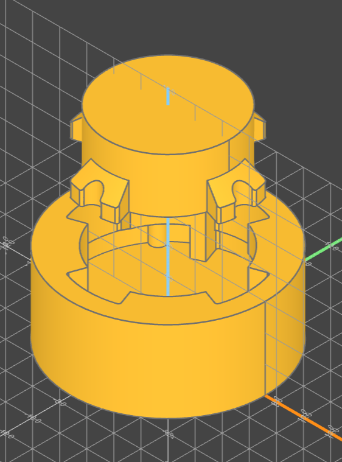

# twist_snap

## Introduction

the twist_snap module provides two functions for generating twist-snap connectors; which can be useful for creating connections that can be repeatedly opened. For example, these are used for connectors for PTFE tubes in the Fender-Bender project.
